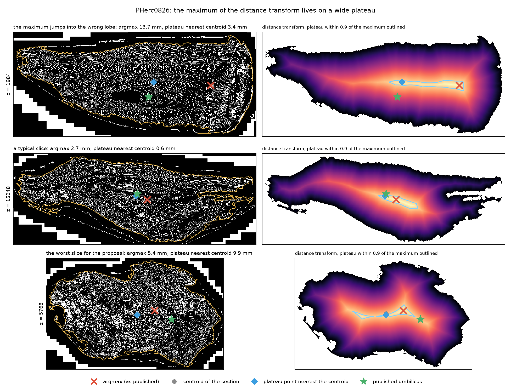
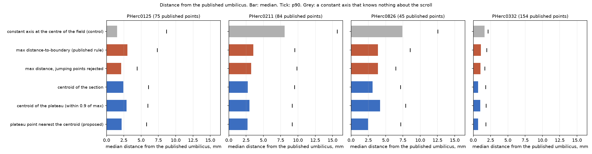

# umbilicus-bench

Score a scroll-axis estimator against the umbilici the Vesuvius Challenge has published.

**This is a frozen copy, and not the living bench.** It is the state of `umbilicus-bench` that the
numbers of `results/e89eb7ad-umbilicus-estimator` were measured against, archived inside the folder so that the article's
commands need no clone, no environment variable and nothing outside the folder that can change. It
is not refreshed. The bench goes on living outside this repository, and that living copy is what
new work should use. Do not measure new rules here: a number produced
in this folder claims to be part of the article's record, and after the freeze it would not be.

The bench was audited on 2026-09-18, after the article's numbers were measured and just before this
copy was taken. **The audit changed no number.** `results/bench.json`, the only file this folder's
tools read from here, is byte for byte the file the article's numbers were checked against, and
`../tools/bench_rules.py` re-checks it cell for cell on every run and fails rather than print a
stale figure. What the audit changed is behaviour the article never exercised: the bench now refuses
to score a scroll whose slices are missing instead of quietly ranking the few that survived, caches
the store metadata so a warm run needs no network, and retries a request that fails.

Of the 23 scrolls in the competition, 20 have no umbilicus published by the challenge and 10 have
none from any source at all, and `fit_spiral` needs one, so estimators are being written. Three of
the twenty-three do have one from the challenge: PHerc0125, PHerc0211 and PHerc0826. The counts
name their set on purpose, because three different numbers were in circulation for this and each
of them was counting a different set. A fourth scroll outside the competition set, PHerc0332, also
has a published umbilicus and a surface prediction of the same family, and it is in the bench too.
Those four are the ground truth the bench scores against, and anyone can run it in under a
minute on a laptop once the slices are cached, on open data, with no GPU.

```
pip install -r requirements.txt
python bench.py                  # every estimator, four scrolls, 46 heights: the table below
python validate.py               # paired tests, leave one scroll out, default sampling
python figures.py                # the figures below
```

This does not claim to be the first thing of its kind. We looked: nothing in `ScrollPrize/villa`
scores an umbilicus against a reference (it is read in a dozen places and checked in none), the
spiral-fitting repository has an umbilicus script but no evaluation of it, and the published
benchmarks in this field measure unwrapped surfaces rather than the axis. If something like this
already exists, open an issue and it will be linked here rather than competed with.

## Read the control first

A constant axis at the centre of the field, which knows nothing about the scroll, is **1.53 mm**
from the published PHerc0125 umbilicus. That is better than every estimator in the table below.

On that scroll this comparison **does not discriminate**, and no ranking taken from it means
anything. It discriminates on PHerc0211 (fake axis 8.07 mm) and PHerc0826 (7.44 mm), and narrowly
on PHerc0332 (1.63 mm against 0.71 mm for the best rule, on a scroll annotated at 2.399 um where
every distance is small). The control is one line of code and it is in `bench.py` as
`fake axis (control)`; we would suggest reporting it next to any umbilicus number, ours included.

## What the bench says

Median distance from the published umbilicus, in mm, 46 heights, pyramid level 3, every estimator
scored on the same published control points. This is `results/bench.json`, and it is what
`python bench.py` prints (see the walkthrough below).

| estimator | PHerc0125 | PHerc0211 | PHerc0826 | PHerc0332 |
|---|---:|---:|---:|---:|
| `argmax`, the point of maximum distance to the boundary (as published upstream) | 3.02 | 3.55 | 3.89 | 1.11 |
| `centroid` of the filled section | 2.44 | 2.74 | 3.12 | **0.70** |
| `plateau_centroid`, centroid of the pixels within 0.9 of the maximum | 2.88 | 3.00 | 4.20 | 1.00 |
| **`plateau_nearest_centroid`**, the plateau point nearest the centroid | **2.17** | **2.71** | **2.47** | 0.71 |
| fake axis (control) | *1.53* | 8.07 | 7.44 | 1.63 |

The paired test, argmax against the plateau reading, is significant on each scroll separately
(Wilcoxon p 2.4e-04, 6.9e-03, 4.5e-02, 5.5e-09). Pooled over the 358 published control points of
the four scrolls the median goes from **1.63 mm to 1.41 mm**, p 5.6e-11; that pool is dominated by
PHerc0332, which holds 154 of the 358 points and is annotated at a voxel four times finer, so the
same test over the three scrolls at 9.362 um is worth reading on its own: 204 points, **3.41 mm to
2.29 mm**, p 1.6e-06 (`results/validate.three-scrolls.json`, which
`python validate.py --scroll PHerc0125 --scroll PHerc0211 --scroll PHerc0826` reproduces).
At `--heights 12`, which is what the upstream estimator runs by default, it is 2.97 to
2.23, 3.73 to 3.20, 3.35 to 2.77 and 1.11 to 0.74 mm.

The 0.9 threshold was chosen after seeing these numbers, so `validate.py` re-checks it by leaving
one scroll out: fix the threshold on the other scrolls, measure on the held-out one. With the three
scrolls at 9.362 um it picked 0.9 every time (2.17, 2.71 and 2.47 mm on the held-out scroll). With
PHerc0332 in the pool it still picks 0.9 when PHerc0125, PHerc0211 or PHerc0332 is held out (2.17,
2.71 and 0.71 mm), but it picks **0.8** when PHerc0826 is held out and gives **3.02 mm** there,
against 2.47 mm at 0.9. Read that plainly: 0.8 and 0.9 are within the noise of four scrolls, and
the threshold is not settled by this data. Both runs are kept: `results/validate.json`, the four
scrolls, and `results/validate.three-scrolls.json`, the three at 9.362 um. Each file names the
scrolls it covers in its own `scrolls` field, so neither can be mistaken for the other.

On PHerc0332 the centroid of the section and the plateau reading are 0.01 mm apart, which is
nothing, and both are within a millimetre of the reference: that scroll says the plateau reading
does not hurt where the section is round, not that it helps.

## Why the argmax loses



The distance transform of a filled scroll section has a wide, nearly flat plateau, a ridge running
along the body of the section. The argmax picks one pixel out of that ridge, so it moves between
lobes from one slice to the next, and those jumps are the large errors. The plateau says where the
core is; the centroid says which end of the ridge belongs to the body of the section.



## Walkthrough

The whole bench is four Python files and a cache. What follows is a run of 2026-09-17 on a CPU
only machine (one process, no GPU), with the slices already cached.

**1. Install.** Python 3.14.4 was used; anything recent should do. The four packages are in
`requirements.txt`, by name and not by version, so `pip` will give you today's releases rather than
ours. That is deliberate: on 2026-09-18 a clean install resolved to numpy 2.5.3, numcodecs 0.17.0
and matplotlib 3.11.2 instead of the versions the committed numbers were produced with, and every
file in `results/` and `report/` still came out byte for byte identical. Pin them from the comment
at the top of `requirements.txt` if you would rather not rely on that.

```
cd results/e89eb7ad-umbilicus-estimator/src/umbilicus-bench          # you already have it: it is in this repository
python -m venv .venv && . .venv/bin/activate
pip install -r requirements.txt
```

Nothing is cloned and no environment variable is set: that is the point of this copy. The tools of
`results/e89eb7ad-umbilicus-estimator` find it here by default, and `../requirements.txt` installs the same four packages
for the whole folder at once if you would rather do it there.

**2. Check the environment with no network.** `examples/` holds one slice per scroll, so this runs
in under a second:

```
$ python example_estimator.py

PHerc0125, level 3, z 10608: section 190937 px, largest inscribed radius 10.9 mm
   argmax (as published upstream)                   0.73 mm from the published umbilicus
   plateau nearest centroid (proposed here)         1.31 mm from the published umbilicus
   bounding box centre (naive, yours to replace)    2.25 mm from the published umbilicus

PHerc0211, level 3, z 9888: section 124940 px, largest inscribed radius 10.0 mm
   argmax (as published upstream)                   2.26 mm from the published umbilicus
   plateau nearest centroid (proposed here)         0.62 mm from the published umbilicus
   bounding box centre (naive, yours to replace)    1.85 mm from the published umbilicus

PHerc0826, level 3, z 8616: section 175197 px, largest inscribed radius 10.7 mm
   argmax (as published upstream)                  12.09 mm from the published umbilicus
   plateau nearest centroid (proposed here)         8.83 mm from the published umbilicus
   bounding box centre (naive, yours to replace)    6.36 mm from the published umbilicus
```

One slice each, and the ranking is different on all three. That is the whole reason for the bench.

**3. The one command.** The first run is the expensive one, and this README used to be quiet about
it while timing the cheap one, so here it is measured on a clean checkout with an empty cache. It
fetches 1278 chunks of the surface predictions, 265 MB over the wire, and writes the 184 slices it
needs as 155 MB under `cache/`: **11 min 17 s** on a CPU only machine, nearly all of it waiting on
request latency rather than on bandwidth. The first `python validate.py` then pulls the 12-height
grid as well, 9 min 31 s more, and the cache settles at 189 MB. That cold run prints exactly the
table below, and after it every run reads the cache and makes no network request at all, in 20 s on
one Xeon core:

```
$ python bench.py

PHerc0125: 75 published control points, 46 heights, level 3
  estimator                    median      p90    worst  points
  fake axis (control)            1.53     8.66    14.17      75
  argmax + hampel                2.12     4.40     7.74      65
  plateau_nearest_centroid       2.17     5.78     6.86      75
  centroid                       2.44     6.07     7.09      75
  plateau_centroid               2.88     5.98     8.75      75
  argmax                         3.02     7.33     9.75      75

PHerc0211: 84 published control points, 46 heights, level 3
  estimator                    median      p90    worst  points
  plateau_nearest_centroid       2.71     9.16    11.73      84
  centroid                       2.74     9.51    11.74      84
  plateau_centroid               3.00     9.17    12.12      84
  argmax + hampel                3.24     9.84    11.80      77
  argmax                         3.55     9.52    14.09      84
  fake axis (control)            8.07    15.69    17.15      84

PHerc0826: 45 published control points, 46 heights, level 3
  estimator                    median      p90    worst  points
  plateau_nearest_centroid       2.47     7.17     9.98      45
  centroid                       3.12     7.15    10.17      45
  argmax                         3.89     8.55    12.28      45
  argmax + hampel                3.89     6.46     7.58      45
  plateau_centroid               4.20     7.88    11.61      45
  fake axis (control)            7.44    12.55    16.07      45

PHerc0332: 154 published control points, 46 heights, level 3
  estimator                    median      p90    worst  points
  centroid                       0.70     1.79     2.79     154
  plateau_nearest_centroid       0.71     1.81     2.80     154
  plateau_centroid               1.00     1.85     2.56     154
  argmax + hampel                1.05     1.65     2.36     151
  argmax                         1.11     1.95     3.06     154
  fake axis (control)            1.63     2.13     2.66     154

written results/bench.json
```

The first row of the first block is the control, and it wins. Every number in the table above is
in that output; `results/bench.json` is the same thing machine readable, and the file committed
here is byte for byte what this run wrote.

**4. The checks.** `python validate.py` (22 s from the cache) prints the paired tests, the
leave-one-scroll-out check and the comparison at 12 heights quoted above, and writes
`results/validate.json`; pass `--out` to write somewhere else, and `--scroll` to restrict it to
some of the four. `python figures.py` (21 s) redraws the two figures above into `figures/`.
`python unknown_scrolls.py` (19 s once cached) runs the rules on three scrolls with no reference,
see below; those three are not in the cache the commands above build, so its own first run downloads
them and adds 180 MB.

If a surface prediction has gone from the bucket, or a cached slice is empty, every one of these
stops with a `MissingData` naming the scroll and the heights, before it writes anything. It does
not score the heights that survived: the rows are medians over control points, and a median over a
sample that quietly lost two thirds of a scroll prints exactly as confidently as a good one, with
the ranking reordered.

**5. Your own rule.** See "Trying a rule of your own" at the end.

## Environment

- Python 3.14.4 on Linux, CPU only. No GPU, no compiled code, no Docker.
- `numpy` 2.5.2, `scipy` 1.18.1, `numcodecs` 0.16.5, `matplotlib` 3.11.1: the versions the numbers
  above were produced with, named in the comment at the top of `requirements.txt`, which installs
  by name and not by version. The same results come out byte for byte on numpy 2.5.3, numcodecs
  0.17.0 and matplotlib 3.11.2, which is what a clean install resolved to on 2026-09-18.
- Network, on the first run only, to `vesuvius-challenge-open-data.s3.amazonaws.com` over plain
  HTTPS, no credentials. The store metadata is cached alongside the slices, so a second run with a
  full cache makes no request at all; you can unplug the machine and check. A request that fails is
  retried five times with a backoff, because a cold run makes enough of them that one reset is
  likely, and one reset used to end the run.
- `report/` is optional. `python report/make_report.py` rebuilds the technical report
  (`report/report.md` and `report/figures/`) from the same cache with the same four packages;
  `--pdf` additionally needs `pandoc` and a LaTeX engine, and says so and stops if they are
  missing. Nothing in `bench.py`, `validate.py` or `figures.py` depends on it.

## What we tried and are not proposing

Dropping control points that jump away from their neighbours (a Hampel-type identifier: distance
from the median of the neighbours, threshold at twice the median deviation over the scroll, so it
scales itself; Hampel 1974, and Pearson et al., *Generalized Hampel Filters*, 2016) is a large gain
**on top of the argmax**, 3.02 to 2.12 mm on PHerc0125. On top of a stable estimator it is close to
nothing, and it costs coverage. It was a cure for the argmax's instability, so with the reading
fixed it is not needed. It is in `estimators.py` as `hampel_reject`, measured rather than adopted.

## Running it on the scrolls that have no umbilicus

```
python unknown_scrolls.py
```

Those are the scrolls an estimator exists for, and there is no ground truth on them, so nothing this
prints is an error: it is how far apart two rules are, and how far each sits from an axis that knows
nothing about the scroll.

| scroll | the two rules are apart | a constant axis is from argmax / plateau |
|---|---:|---:|
| PHerc1203 | 1.87 mm | 2.59 / 2.26 mm |
| PHerc1545 | 2.37 mm | 6.07 / 4.85 mm |
| PHerc0268 | 3.55 mm | 6.23 / 3.24 mm |

Read the right column first. On **PHerc1203** a constant axis sits as close to both rules as the two
rules sit to each other: on that scroll the choice of rule is not evidence of anything, and neither
is our improvement. On PHerc1545 the two agree with each other and not with the constant, which is
what a real signal looks like. On PHerc0268 the plateau reading is closer to the field centre than
it is to the argmax, and we do not know what that means; we would rather leave it in the table than
leave it out.

## Which references are in, and which are not

- **In:** PHerc0125, PHerc0211, PHerc0826 (the three competition scrolls with a challenge
  umbilicus, annotated at 9.362 um) and PHerc0332 (outside the competition set, annotated at
  2.399 um; its only published surface prediction is already downsampled by four, and `data.py`
  carries that factor explicitly because a hardcoded `2 ** level` is wrong by four on it).
- **Out, PHerc0139:** it has a published umbilicus, annotated on its 2.399 um scan, while its
  surface prediction lives on the 9.362 um scan, and the transform between the two scans is not
  published (the catalogue's `volume_transforms` is null). Scoring against a registration of our
  own would put our error into the metric.
- **Not yet in, PHercParis4:** it has both a published umbilicus and a surface prediction of the
  same family (an L2 store, like PHerc0332's). It was not measured here and no number about it is
  claimed; it is the next reference to add, with the same `store_scale` handling as PHerc0332.

## What this bench does not measure

Whether a better axis produces a better spiral fit. `fit_spiral` is not practical on CPU, so the
downstream effect of the improvement is untested here: what is measured is the distance from the
published axis, and the disappearance of the multi-millimetre jumps that an initialization is most
likely to suffer from. We think that matters, but we have not shown it.

Nor does it say which estimator is right on a scroll with no published umbilicus. There, two
estimators disagreeing is a discrepancy, not an error.

## What is in here, and what we measured

The run behind the table above is kept in the repository, so the numbers can be checked, re-analysed
or argued with without spending the network time again.

| | |
|---|---|
| [`results/bench.json`](results/bench.json) | the table above, machine readable, four scrolls |
| [`results/validate.json`](results/validate.json) | the paired tests, the leave-one-out check and the default-heights comparison on the four scrolls: what `python validate.py` writes |
| [`results/validate.three-scrolls.json`](results/validate.three-scrolls.json) | the same three checks on the three scrolls at 9.362 um, which is the run quoted twice above: `python validate.py --scroll PHerc0125 --scroll PHerc0211 --scroll PHerc0826` |
| [`results/estimates/`](results/estimates) | the control points every rule produced, one file per scroll and rule, in the same shape as a published `umbilicus.json`. Score them with your own metric if you do not like ours |
| [`results/errors.csv`](results/errors.csv) | 2128 rows: scroll, estimator, height, published point, error in mm. One line per number that went into the table |
| [`results/unknown-scrolls.json`](results/unknown-scrolls.json) | the table of the three scrolls without a reference |
| [`reference/`](reference) | the four published umbilici, the ground truth this was measured against. [`reference/README.md`](reference/README.md) gives the bucket object each came from, its checksum and how to fetch it again |
| [`examples/`](examples) | one slice each for PHerc0125, PHerc0211 and PHerc0826, 25 to 35 kB each, so the example runs with no network. Their provenance and checksums are in [`examples/README.md`](examples/README.md) |
| [`report/`](report) | a longer technical report with eight figures, rebuilt by `report/make_report.py`; optional |

## Trying a rule of your own

```
python example_estimator.py
```

It reads the example slices, runs the published rule, the one proposed here and a deliberately naive
one, and prints how far each lands from the published umbilicus at that height. On those three
slices the ranking comes out different every time: the published rule wins one, this one wins
another, the naive one wins the third. That is exactly why the bench is 46 heights on four scrolls
with a negative control, and why one convincing picture of one slice is worth nothing.

An estimator here is any function of the filled section and its distance transform that returns a
point:

```python
def my_rule(mask, dist):
    ys, xs = np.where(dist >= 0.8 * dist.max())
    return float(xs.mean()), float(ys.mean())

est.ESTIMATORS["my_rule"] = my_rule      # then: python bench.py
```

## Method

For every published control point inside the estimate's z coverage, the estimate is interpolated at
that height and the distance is taken in the xy plane, in millimetres at the voxel size of the frame
the umbilicus is annotated in (9.362 um, or 2.399 um for PHerc0332). Every estimator is scored on
the same set of points, the ones inside every coverage, so that a shorter polyline cannot look
better by skipping the hard end of a scroll. Slices are read once at pyramid level 3, cached under
`cache/`, and reused by every estimator, so the only thing that changes between rows is the reading
of the section.

## Credits and licence

`estimate_umbilicus.py`, the estimator this bench started from, is by gmDevi in
[ScrollPrize/villa#1736](https://github.com/ScrollPrize/villa/pull/1736).

**The code here is MIT** (`LICENSE`), Giovanni Pellerano.

**The data is not.** `examples/`, `reference/` and the tables derived from them in `results/` come
from the Vesuvius Challenge open-data bucket and stay under **CC BY-NC 4.0**: attribution required,
non-commercial use only. Details and the citation the organizers ask for are in
[`LICENSE-DATA.md`](LICENSE-DATA.md):

> Giorgio Angelotti, Stephen Parsons, Sean Johnson, Elian Rafael Dal Pra, Johannes Rudolph,
Paul Tafforeau, Alessandro Mirone, et al. *Vesuvius Challenge - CT Scans of Herculaneum
Papyri*. Vesuvius Challenge. 2026
