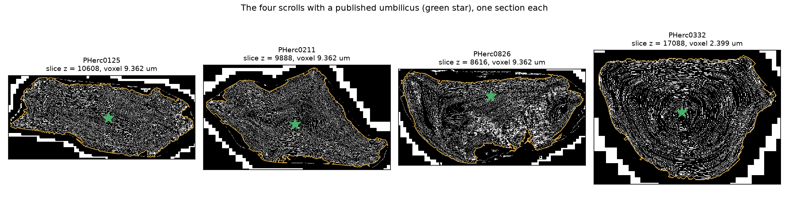
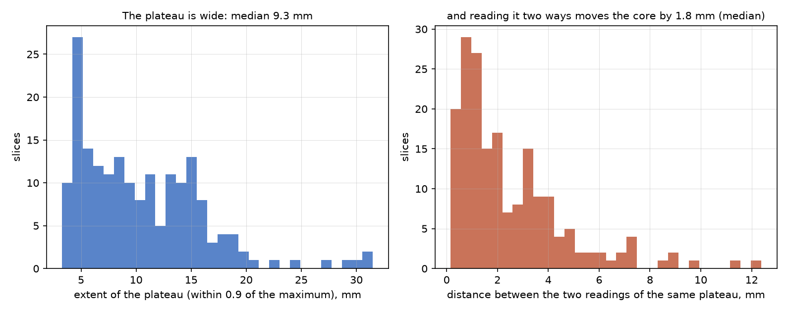
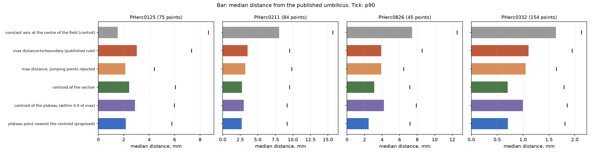
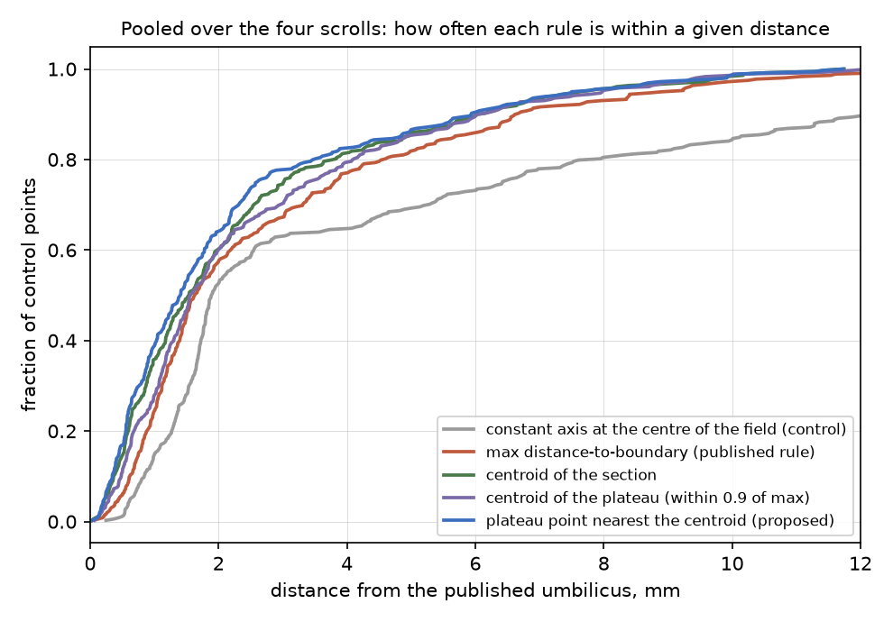
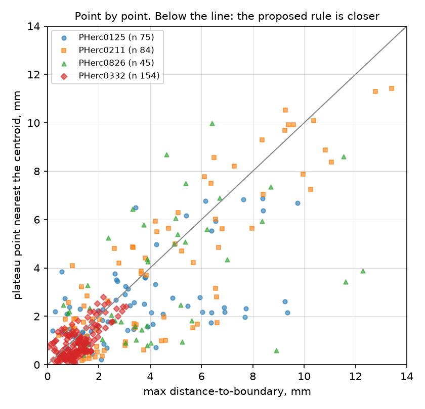
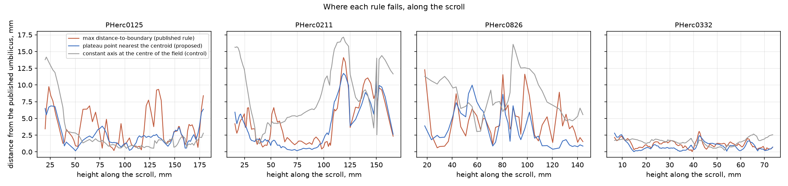
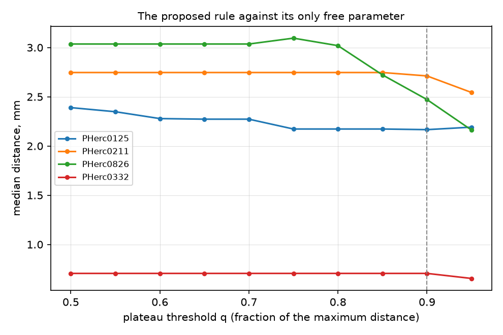
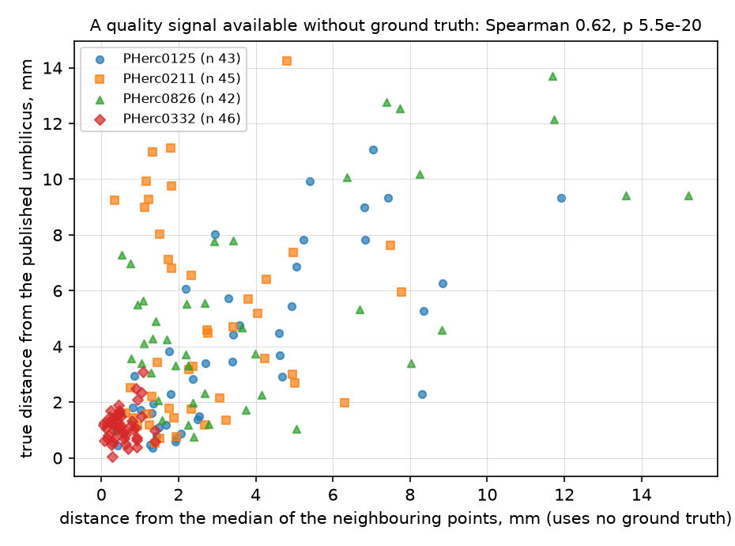

## Abstract

Of the 23 Herculaneum scrolls in the competition, 20 have no umbilicus published by the challenge, and the spiral-fitting pipeline needs one, so automatic estimators are being written with nothing to check them against. 4 scrolls have both a published umbilicus and a surface prediction of the same family, three of them in the competition and one outside it. This report turns those 4 into a bench, measures every estimator we could think of on identical inputs, and reports the one control that most such comparisons omit. The published rule, the argmax of the distance transform of the filled section, is unstable because that transform has a wide plateau: its extent is 9.3 mm at the median, and two defensible readings of the same plateau put the core 1.8 mm apart. Reading the plateau instead of its argmax, by taking the point within 0.9 of the maximum nearest the centroid of the section, lowers the median distance from the published umbilicus from 1.63 mm to 1.41 mm over 358 control points (Wilcoxon p = 5.6e-11). The uncomfortable control: on PHerc0125 a constant axis at the centre of the field, which knows nothing about the scroll, is 1.53 mm from the published umbilicus, closer than every estimator measured here. On that scroll the comparison does not discriminate, and we report it against ourselves.

## 1. The problem

An umbilicus is the polyline through the winding centre of a rolled scroll, used to initialise spiral fitting and to unroll in polar coordinates. For most scrolls it does not exist, and where it does it was placed by hand. An estimator is therefore judged, if at all, by whether the pipeline downstream of it produces something; that is a slow and confounded signal. The scrolls with a published umbilicus make a direct measurement possible, and there are few enough of them that the whole bench runs on a laptop in minutes.

## 2. Data

| scroll | published control points | scored | voxel (um) | prediction store |
|---|---:|---:|---:|---|
| PHerc0125 | 83 | 75 | 9.362 | level 0 |
| PHerc0211 | 87 | 84 | 9.362 | level 0 |
| PHerc0826 | 49 | 45 | 9.362 | level 0 |
| PHerc0332 | 169 | 154 | 2.399 | already downsampled (L2) |

Every estimate is computed on the published surface prediction of that scroll, read once at pyramid level 3 at 46 heights spaced evenly between 8 and 92 per cent of the scroll, and reused by every rule. PHerc0332 is the awkward and instructive case: it was scanned once, at 2.399 um, and the only surface prediction published for it is already downsampled by four, so the factor between the store and the frame its umbilicus is annotated in is 32 and not 8. A published script that hardcodes that factor writes control points four times too small, which on this scroll is 21 mm.



## 3. The estimators

Each rule is a function of the filled largest connected component of the sheet mask and of its Euclidean distance transform. Nothing else differs between them.

- **max distance-to-boundary** (the published rule): the pixel where the distance transform is largest, described upstream as the innermost point of the winding pack.
- **centroid of the section**: the centre of mass of the filled component.
- **centroid of the plateau**: the centre of mass of the pixels within a fraction q of the maximum distance, q = 0.9.
- **plateau point nearest the centroid** (proposed): among those same pixels, the one closest to the centroid of the component.
- **jumping points rejected**: a Hampel-type identifier applied to the polyline of any of the above, dropping control points further than twice the median deviation from the median of their neighbours (Hampel 1974; Pearson et al. 2016).
- **constant axis at the centre of the field** (negative control): a straight line through the centre of the volume's bounding box, which uses no data at all.




## 4. Metric and protocol

For every published control point inside the z coverage of the slice grid, the estimate is interpolated at that height and the distance is taken in the xy plane, in millimetres at the voxel size of the frame the umbilicus is annotated in. Every rule is scored on the same points. The median is the primary statistic; the p90 and the worst case are reported next to it because, for an initialisation, the tail is what breaks the fit. Paired comparisons use the Wilcoxon signed-rank test over control points.

## 5. Results

| scroll | max distance-to-boundary | centroid of the section | centroid of the plateau | plateau point nearest the centroid | control |
|---|---:|---:|---:|---:|---:|
| PHerc0125 | 3.02 | 2.44 | 2.88 | 2.17 | *1.53* |
| PHerc0211 | 3.55 | 2.74 | 3.00 | 2.71 | *8.07* |
| PHerc0826 | 3.89 | 3.12 | 4.20 | 2.47 | *7.44* |
| PHerc0332 | 1.11 | 0.70 | 1.00 | 0.71 | *1.63* |
| **pooled** | **1.63** | **1.54** | **1.56** | **1.41** | *1.89* |

Median distance from the published umbilicus, in mm. Same table for the p90:

| scroll | max distance-to-boundary | centroid of the section | centroid of the plateau | plateau point nearest the centroid |
|---|---:|---:|---:|---:|
| PHerc0125 | 7.33 | 6.07 | 5.98 | 5.78 |
| PHerc0211 | 9.52 | 9.51 | 9.17 | 9.16 |
| PHerc0826 | 8.55 | 7.15 | 7.88 | 7.17 |
| PHerc0332 | 1.95 | 1.79 | 1.85 | 1.81 |





The paired comparison between the published rule and the proposed one, over the 358 pooled control points, gives a median of 1.63 mm against 1.41 mm, Wilcoxon p = 5.6e-11. Per scroll:

| scroll | published rule | proposed | closer on | p |
|---|---:|---:|---:|---:|
| PHerc0125 | 3.02 | 2.17 | 52 of 75 | 2.4e-04 |
| PHerc0211 | 3.55 | 2.71 | 48 of 84 | 6.9e-03 |
| PHerc0826 | 3.89 | 2.47 | 28 of 45 | 4.5e-02 |
| PHerc0332 | 1.11 | 0.71 | 114 of 154 | 5.5e-09 |





## 6. Controls

**The negative control.** A constant axis at the centre of the field is 1.53 mm on PHerc0125, 8.07 mm on PHerc0211, 7.44 mm on PHerc0826, 1.63 mm on PHerc0332. On the scroll where that number is smaller than every estimator's, the comparison does not discriminate and no ranking taken from it means anything. We would suggest reporting this control next to any umbilicus number, and we report it against ourselves.

**The intermediate rule.** The centroid of the plateau lands between the argmax and the proposed rule on most scrolls, which is what one expects if the plateau carries the information and the argmax is the unstable way to read it.

## 7. Sensitivity and validation

The plateau threshold q is the only free parameter, and it was chosen after seeing the bench. Its curve is flat where it matters:

| scroll | q=0.5 | q=0.55 | q=0.6 | q=0.65 | q=0.7 | q=0.75 | q=0.8 | q=0.85 | q=0.9 | q=0.95 |
|---|---:|---:|---:|---:|---:|---:|---:|---:|---:|---:|
| PHerc0125 | 2.39 | 2.35 | 2.28 | 2.27 | 2.27 | 2.17 | 2.17 | 2.17 | 2.17 | 2.19 |
| PHerc0211 | 2.75 | 2.75 | 2.75 | 2.75 | 2.75 | 2.75 | 2.75 | 2.75 | 2.71 | 2.54 |
| PHerc0826 | 3.04 | 3.04 | 3.04 | 3.04 | 3.04 | 3.10 | 3.02 | 2.72 | 2.47 | 2.16 |
| PHerc0332 | 0.71 | 0.71 | 0.71 | 0.71 | 0.71 | 0.71 | 0.71 | 0.71 | 0.71 | 0.66 |



A leave-one-scroll-out check, run by `validate.py`, fixes q on all scrolls but one and measures on the held-out scroll. It does not settle q: it selects q = 0.9 holding out PHerc0125 (2.17 mm), q = 0.9 holding out PHerc0211 (2.71 mm), q = 0.8 holding out PHerc0826 (3.02 mm), q = 0.9 holding out PHerc0332 (0.71 mm). The threshold used throughout this report is 0.9; on PHerc0826 the held-out selection differs, which says that these thresholds are within the noise of 4 scrolls and that q is not settled by this data.

**A quality signal without ground truth.** The distance of a control point from the median of its neighbours correlates with its true error (Spearman 0.62, p = 5.5e-20, n = 176), so a polyline can be audited where no reference exists. Rejecting the points beyond twice the median deviation is a large gain on top of the argmax and close to nothing on top of a stable rule, which is why it is measured here and not adopted as a default.



## 8. What this does not show

Whether a better axis produces a better spiral fit. The fitter is not practical on CPU here, so the downstream effect is untested: what is measured is the distance from the published axis and the disappearance of the multi-millimetre jumps. On scrolls with no published umbilicus, two estimators disagreeing is a discrepancy and not an error, and `unknown_scrolls.py` reports it as such, with the constant axis next to it.

The bench is four scrolls because four is all there is. A fifth, PHerc0139, has a published umbilicus annotated on a different scan from its surface prediction, and the transform between two scans of the same scroll is not published; scoring against a registration of our own would put our error into the metric, so it is left out.

## 9. Reproducing

```
pip install -r requirements.txt
python bench.py
python validate.py
python report/make_report.py --pdf
```

Everything reads the Vesuvius Challenge open-data bucket. Slices are cached under `cache/`; the four published umbilici used as ground truth are copied into `reference/`, and the control points every rule produced are in `results/estimates/`, so the tables can be recomputed with a different metric without rerunning anything.

## References

- F. R. Hampel, *The influence curve and its role in robust estimation*, JASA 69 (1974).
- R. K. Pearson et al., *Generalized Hampel Filters*, EURASIP J. Adv. Signal Process. (2016).
- C. Leys et al., *Detecting outliers: do not use standard deviation around the mean, use absolute deviation around the median*, J. Exp. Soc. Psychol. 49 (2013).
- Vesuvius Challenge open data, CC BY-NC 4.0; see `LICENSE-DATA.md` for the citation.
